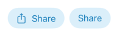
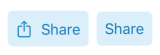
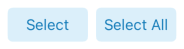
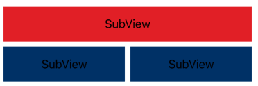
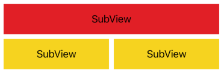
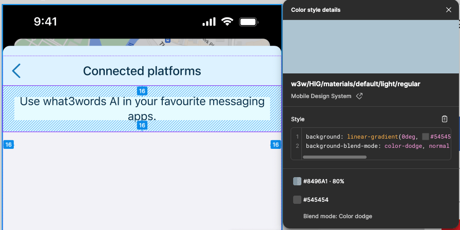
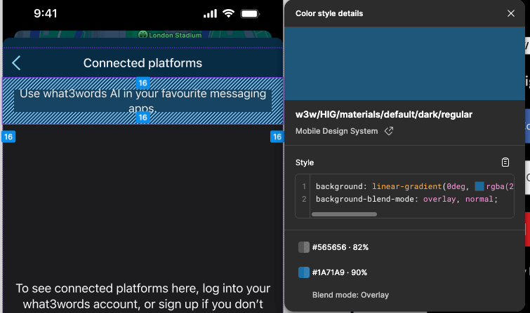

# Design Package

## Theme Environment Introduction

``` swift
extension EnvironmentValues {
  @Entry var theme = W3WSwiftUITheme(theme: .what3words)
}
```

You can now access the theme anywhere for fonts and colors:

``` swift
struct ExampleView: View {
  @Environment(\.theme) private var theme

  var body: some View {
    Text("Hello w3w!")
      .padding()
      .background(theme.fillsSecondary)
      .foregroundColor(theme.labelsPrimary)
      .font(theme.font(.largeTitle, weight: .medium, italic: false))
  }
}
```


A more concise version:

``` swift
struct ExampleView: View {
  var body: some View {
    Text("Hello w3w!")
      .padding()
      .w3wForeground(\.labelsPrimary)
      .w3wBackground(\.fillsSecondary)
      .w3wFont(.largeTitle, weight: .medium, italic: false)
  }
}
```

> Note: When using the key-path style (`\.labelsPrimary`), we lose
> dynamicMemberLookup,\
> so you need to prefix the key path with `\`.

`w3wBackground` also supports a `size` parameter to automatically apply
one of the three system-design sizes and **shapes**

``` swift
struct ExampleView: View {
  var body: some View {
    HStack {
      Text("Button")
        .frame(width: 100, height: 40)
        .w3wBackground(\.fillsQuaternary)

      Text("Button")
        .w3wBackground(\.fillsQuaternary, size: .medium)
    }
    .w3wForeground(\.labelsSecondary)
    .w3wFont(.subheadline)
  }
}
```


> When `size` is set to `none` (or omitted), it means you are fully
> responsible\
> for sizing the view manually.

## Using `w3wButtonStyle`

``` swift
struct ExampleView: View {
  var body: some View {
    HStack {
      Button("Share", systemImage: "square.and.arrow.up", action: {})
      Button("Share", action: {})
    }
    .w3wButtonStyle(\.fillsQuaternary, size: .medium)
  }
}
```



For non‑system‑design layouts:

``` swift
struct ExampleView: View {
  var body: some View {
    HStack { ... }
    .w3wButtonStyle(\.fillsQuaternary, shape: .rect(cornerRadius: 5)) { label in
      label.padding(8)
    }
  }
}
```



> Since shape (e.g., corner radius) is applied **after** the
> background,\
> we expose it as a separate parameter.

## Handling Custom Layout Cases

In this example, we ensure equal-width buttons based on the widest content:

``` swift
private struct ExampleView: View {
  @State private var itemMinSize: CGSize = .zero

  var body: some View {
    HStack {
      Button(action: {}) {
        Text("Select")
          .trackItemMinSize(itemMinSize)
      }
      Button(action: {}) {
        Text("Select All")
          .trackItemMinSize(itemMinSize)
      }
    }
    .onItemMinSizeChange { itemMinSize = $0 }
    .w3wButtonStyle(\.fillsQuaternary, shape: .rect(cornerRadius: 5)) { label in
      label.padding(8)
    }
  }
}
```



## Injecting a New Theme
Inject it at certain view and the new theme will affects it and its decendants

``` swift
let custom = W3WSwiftUITheme(theme: .init(fillsPrimary: .blue))
```

``` swift
struct ExampleView: View {
  var body: some View {
    VStack {
      SubView()
      HStack {
        SubView()
        SubView()
      }
      .environment(\.suTheme, .custom)
    }
  }
}
```



## Modifying a Theme

In cases where we only need to slightly adjust the theme (such as in the OCR or Chat-AI packages), we can modify the existing theme environment, and the changes will automatically apply to the view and all of its descendants

``` swift
struct ExampleView: View {
  var body: some View {
    VStack {
      SubView()
      HStack {
        SubView()
        SubView()
      }
      .modifyTheme { theme in
        theme.fillsPrimary = .yellow
      }
    }
  }
}
```



## Introducing `colorMode`

``` swift
extension EnvironmentValues {
  @Entry var colorMode: W3WColorMode = W3WColor.theme
}
```

In some parts of the UI (whatsapp integration, ocr..), certain backgrounds are created by blending two colors that are not part of the system design palette



``` swift
@ViewBuilder
private var background: some View {
  switch colorMode {
  case .light:
    ZStack {
      W3WCoreColor(hex: 0x8496A1).suColor.opacity(0.8)
      W3WCoreColor(hex: 0x545454).suColor.blendMode(.colorDodge)
    }

  case .dark:
    ZStack {
      W3WCoreColor(hex: 0x565656).suColor.opacity(0.82)
      W3WCoreColor(hex: 0x1A71A9).suColor.opacity(0.9).blendMode(.overlay)
    }
  }
}
```
